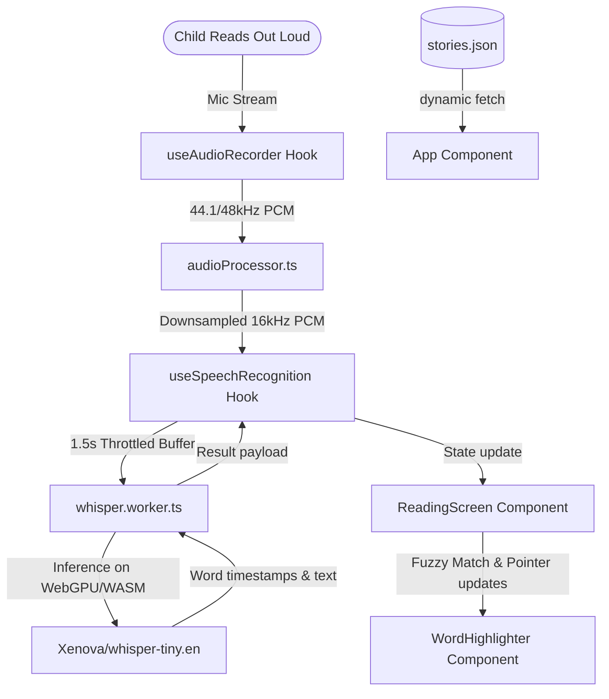

# LuminaRead Developer Guide (`gemini.md`)

Welcome to the developer reference guide for **LuminaRead**, a 100% client-side, offline-capable Progressive Web App (PWA) designed for children learning to read on iPads. This guide outlines the application architecture, build system, and AI components.

---

## 🎯 Project Purpose

The primary goal of **LuminaRead** is to assist 6-year-old children in learning to read by providing an interactive, engaging, and entirely on-device voice companion. 

Key product mandates include:
1. **100% Client-Side Execution**: Running AI inference locally on WebGPU/WASM ensures absolute privacy, requires no backend server hosting costs, and works completely offline (PWA-enabled).
2. **Child-Safe and Offline-Capable**: Fits standard iPad school and household environments where internet access may be spotty, restricted, or unmonitored.
3. **Patience-First Pointer Tracking**: Designed to keep pace with children's speech patterns, ignoring repetitive struggles (e.g., repeating a word to find their footing) and allowing minor mispronunciations (fuzzy string matching) without disrupting their progress.
4. **Gamified Reinforcement**: Visual rewards (highlighters, confetti) and auditory chimes keep kids positive, encouraged, and excited to finish stories.

---

## 🏗️ Architecture Overview



---

## 🛠️ Key Technical Components

### 1. On-Device Whisper Worker ([whisper.worker.ts](file:///Users/gyandeeps/code/lumina-read/src/workers/whisper.worker.ts))
* **Model**: Quantized ONNX weights for `Xenova/whisper-tiny.en` downloaded and cached locally in browser IndexedDB.
* **Acceleration**: Prioritizes standard `webgpu` execution. In case of browser or device incompatibility (e.g. older Safari iOS versions), it catches the initialization failure and falls back to WebAssembly (`wasm`).
* **Offline Path**: Overrides backend WASM lookup paths locally to `/wasm/`.

### 2. Audio Capture & Downsampler ([useAudioRecorder.ts](file:///Users/gyandeeps/code/lumina-read/src/hooks/useAudioRecorder.ts))
* **iOS Safari Autoplay Bypass**: Initializes `AudioContext` inside user click events (the large, tactile start button) to comply with Safari security contexts.
* **PCM Downsampling**: Downsamples Float32 PCM arrays from browser native sample rates (e.g. 48kHz) to **16kHz mono** PCM required by Whisper using a moving-average window.

### 3. Speech Sync & Throttling ([useSpeechRecognition.ts](file:///Users/gyandeeps/code/lumina-read/src/hooks/useSpeechRecognition.ts))
* **Streaming Accumulation**: Appends micro-audio chunks into a single rolling Float32Array representing the entire spoken sentence.
* **Throttled Inference**: Triggers worker execution every 1.5 seconds. Uses a lock flag (`isProcessingRef`) to prevent worker congestion, queuing a catch-up run if audio arrives while active.
* **Dynamic Reset**: Exposes `resetTranscript()` to clear residual audio states when transitioning sentences or retrying.

### 4. Fuzzy Match & Repetition Pointer Logic ([fuzzyMatch.ts](file:///Users/gyandeeps/code/lumina-read/src/utils/fuzzyMatch.ts))
* **Levenshtein Distance**: Matches words fuzzy-wise (distance $\le 2$ edit characters). Applies stricter constraints (distance $\le 1$) for short words (length $\le 2$ characters) to avoid false matches.
* **Pointer Repetition Safe-Gate**: Advances the index sequentially but ignores repetitions (e.g., if target is `"The cat ran"` and child repeats `"The... The cat"`, the matcher ignores repeated words and stays on `"cat"` once matched).

---

## 🚀 Static Assets & PWA Caching

### 1. Local WASM serving ([vite.config.ts](file:///Users/gyandeeps/code/lumina-read/vite.config.ts))
* A custom Vite dev plugin serves the ONNX Runtime WebAssembly and MJS worker scripts dynamically during development from `node_modules/onnxruntime-web/dist/`. 
* The plugin parses and strips bundler-specific query variables (like `?import` appended by Vite dev server), avoiding browser dynamic load exceptions.
* During builds, `closeBundle()` copies these assets to `dist/wasm/`.

### 2. Service Worker Caching
* Caches static chimes ([success-chime.mp3](file:///Users/gyandeeps/code/lumina-read/src/assets/success-chime.mp3)), manifest configurations, CSS, JS, and local WebAssembly files.
* Workbox is configured with a **30MB maximum file size limit** to successfully cache the large ONNX Runtime WebAssembly binaries.

### 3. Dynamic Story Content
* Story assets are loaded from `/stories.json`. This allows server managers or educators to update sentences and content lists on-demand without code compilation.

---

## 💻 Developer Scripts

Install dependencies:
```bash
npm install
```

Start local development server (with dynamic WASM serving and Hot Module Replacement):
```bash
npm run dev
```

Run TypeScript verification check:
```bash
npx tsc --noEmit
```

Build production distribution bundle (generates assets, copies WASM files to `dist/wasm/`, and compiles PWA service worker):
```bash
npm run build
```

Preview the production build locally:
```bash
npm run preview
```
