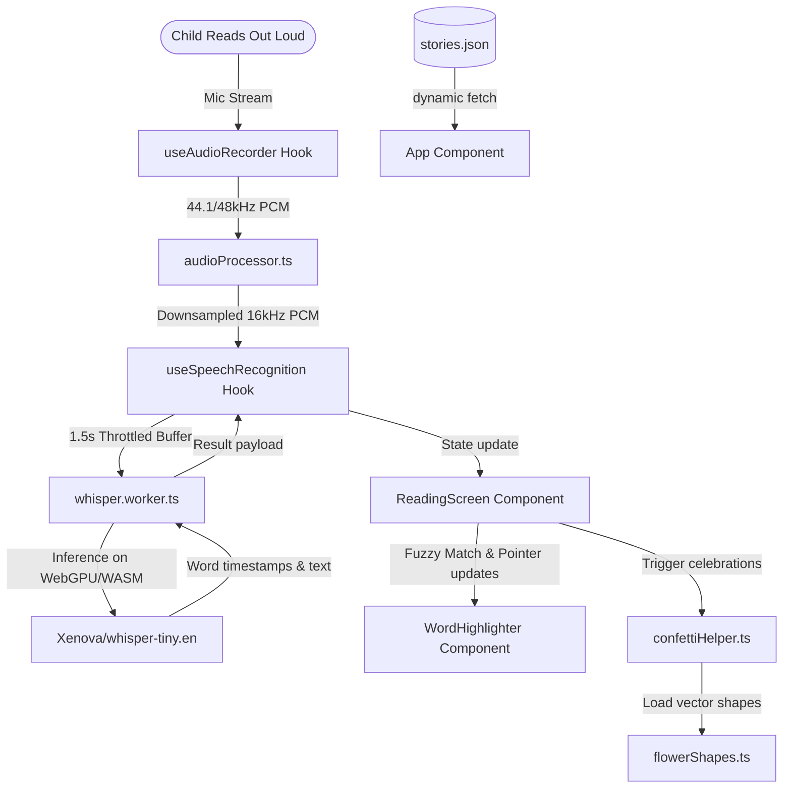

# LuminaRead Agent Context & Developer Guide (`GEMINI.md`)

This guide outlines the core architecture, file mapping, critical constraints, and verification workflows optimized for AI coding agents.

---

## 🎯 Project Overview & UX Mandates
- **Goal**: A child-safe, 100% offline client-side PWA helping young children (6yo) learn to read on iPads.
- **Privacy/Execution**: AI inference runs entirely on-device (Whisper-tiny.en via WebGPU/WASM, cached in IndexedDB). No backend is used.
- **Kid-Friendly UX**: Patience-first pointer tracking that tolerates word repetition and minor pronunciation errors (fuzzy Levenshtein matching).
- **Autoplay/Mic Automation**: Microphone starts automatically on sentence transition to avoid repetitive clicking. Speech synthesis (TTS help) and microphone recording are mutually exclusive to prevent audio feedback.

---

## 🏗️ Architecture & Data Flow

---

## 📂 File Registry
- [whisper.worker.ts](file:///Users/gyandeeps/code/lumina-read/src/workers/whisper.worker.ts): ONNX execution. WebGPU-first with WASM fallback. Paths mapped to local `/wasm/`.
- [useAudioRecorder.ts](file:///Users/gyandeeps/code/lumina-read/src/hooks/useAudioRecorder.ts): Captures mic and downsamples to 16kHz. Delays `AudioContext` initialization until user click to bypass iOS Safari autoplay security.
- [useSpeechRecognition.ts](file:///Users/gyandeeps/code/lumina-read/src/hooks/useSpeechRecognition.ts): Accumulates raw PCM chunks and schedules inference every 1.5 seconds. Uses lock `isProcessingRef` to prevent worker congestion.
- [fuzzyMatch.ts](file:///Users/gyandeeps/code/lumina-read/src/utils/fuzzyMatch.ts): Levenshtein matching (distance $\le 2$ edit chars, stricter $\le 1$ for words $\le 2$ chars). Prevents backtracking and handles repetitions safely.
- [ReadingScreen.tsx](file:///Users/gyandeeps/code/lumina-read/src/components/ReadingScreen.tsx): Drives reading UI, coordinates TTS pronunciation help, and manages audio state switches.
- [WordHighlighter.tsx](file:///Users/gyandeeps/code/lumina-read/src/components/WordHighlighter.tsx): Renders styled word states (amber/speaker for TTS help, green for read, gray for pending).
- [flowerShapes.ts](file:///Users/gyandeeps/code/lumina-read/src/utils/flowerShapes.ts) / [confettiHelper.ts](file:///Users/gyandeeps/code/lumina-read/src/utils/confettiHelper.ts): Canvas-drawn high-resolution vector shapes cached in-memory as `ImageBitmap` for confetti explosions.
- [vite.config.ts](file:///Users/gyandeeps/code/lumina-read/vite.config.ts): Custom plugin to copy ONNX runtime assets to `/dist/wasm/` and configures PWA service worker size limits.

---

## ⚠️ Critical Constraints & Gotchas
1. **Audio Sample Rate**: Whisper requires exactly **16kHz mono PCM**. Audio must be downsampled via a moving-average window.
2. **Safari Mic Blocks**: `AudioContext` initialization must happen synchronously within a direct user interaction click event handler.
3. **TTS Feedback Loop**: Speech synthesis and speech recognition must not run concurrently. Always invoke `stopListening()` prior to speaking a word via TTS, and `startListening()` in its `onend`/`onerror` handlers.
4. **Service Worker Binary Size**: Caching ONNX WASM binaries requires setting Workbox's maximum size limit to **30MB** in `vite.config.ts`.
5. **Autoplay Mic State**: When moving to the next sentence, restart microphone capture and transition status to `Listening` programmatically.

---

## 🤖 Pre-Commit Verification Workflow
AI agents must run these validation steps before proposing a commit:
1. **Sitemap Update**: Check [sitemap.xml](file:///Users/gyandeeps/code/lumina-read/public/sitemap.xml) and ensure the `<lastmod>` tag is set to today's date (`YYYY-MM-DD`).
2. **Type Check**: Run `npx tsc --noEmit`.
3. **Lint Check**: Run `npm run lint`.
4. **Production Build**: Run `npm run build` to confirm bundler processes and assets copy correctly.
